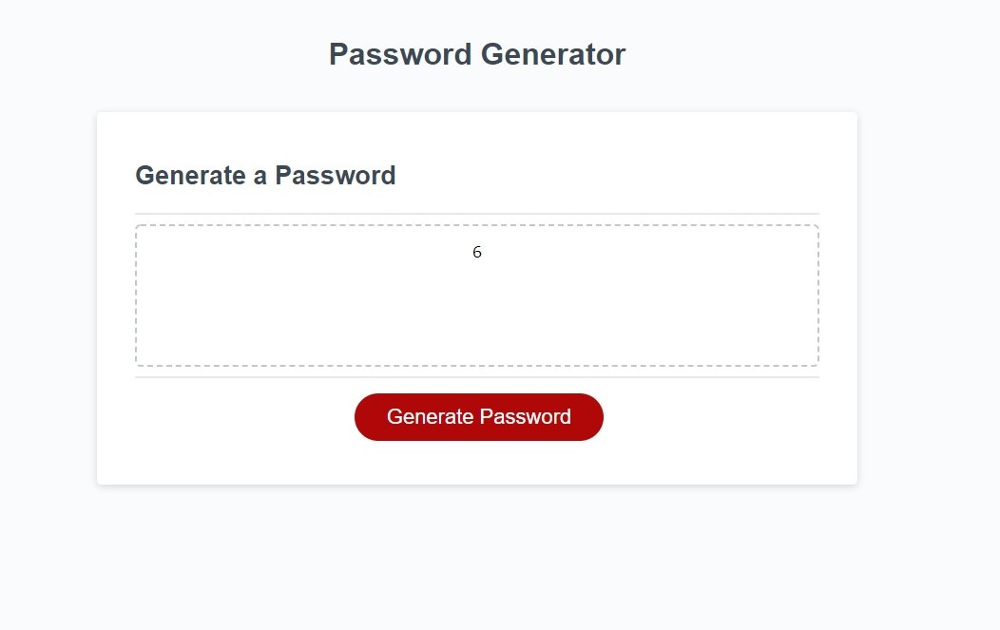

# Kairos
Password Generator Application 

### In this application I attempted to create a password generator that rendered a password based on user input. The application currently does not give out more than one input. However, I was able to get the confirmations to work. 

### I used the following resources to help me build my code:
```
www.w3schools.com
www.stackoverflow.com
UTSA Bootcamp Module 3
```

The following image shows a screenshot of the application. 



## Accepted Criteria 

```
GIVEN I need a new, secure password
WHEN I click the button to generate a password
THEN I am presented with a series of prompts for password criteria
WHEN prompted for password criteria
THEN I select which criteria to include in the password
WHEN prompted for the length of the password
THEN I choose a length of at least 8 characters and no more than 128 characters
WHEN asked for character types to include in the password
THEN I confirm whether or not to include lowercase, uppercase, numeric, and/or special characters
WHEN I answer each prompt
THEN my input should be validated and at least one character type should be selected
WHEN all prompts are answered
THEN a password is generated that matches the selected criteria
WHEN the password is generated
THEN the password is either displayed in an alert or written to the page
```

The link to the website is here: 